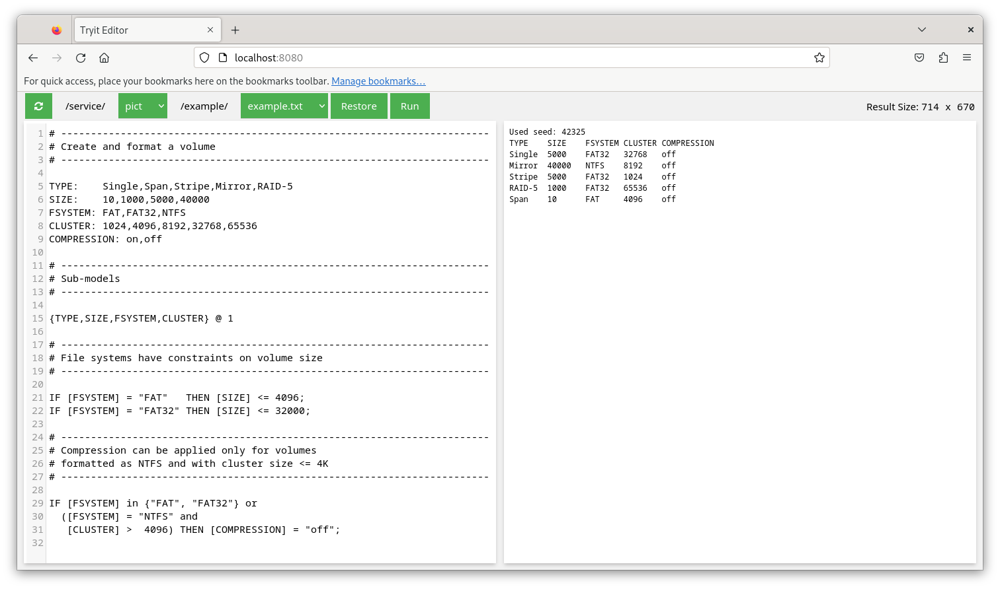

# Tryit Editor for PICT

Tryit Editor for https://github.com/microsoft/pict

## Screenshot

## Usage
Run the container image as follows

    podman run -it --rm -p 8080:8080 quay.io/apodhrad/tryit-editor-pict:latest

and navigate to http://localhost:8080
